# ConfigServer

LoongCollector 的配置管理服务，提供 Agent 配置下发、WebUI 管理界面和 Prometheus 指标采集。

---

## 界面预览

### 登录

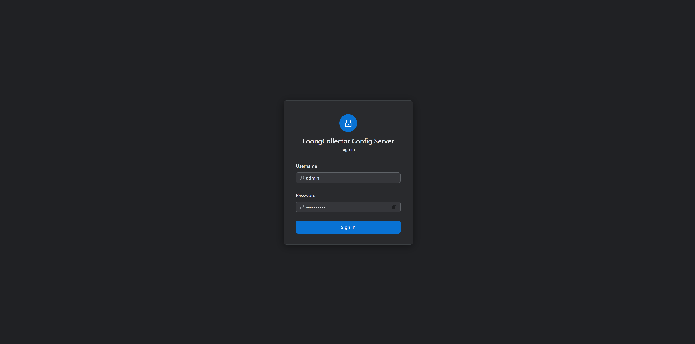

### 亮色 / 暗色主题

| 亮色主题 | 暗色主题 |
|---------|---------|
| 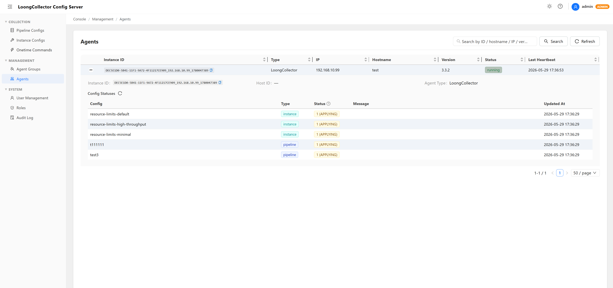 | 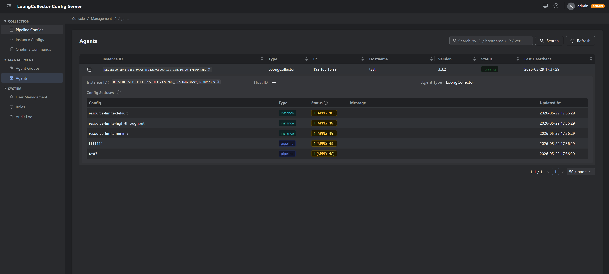 |

### 采集配置管理

**Pipeline 配置列表**

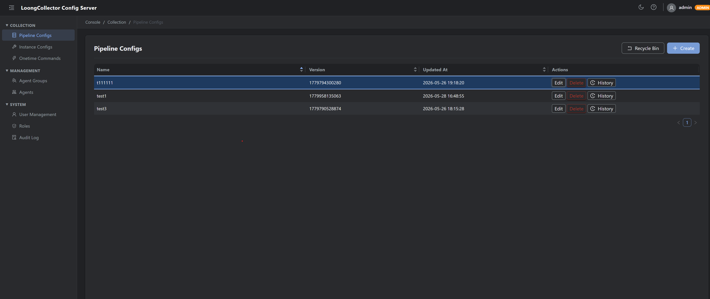

**Pipeline 配置详情**

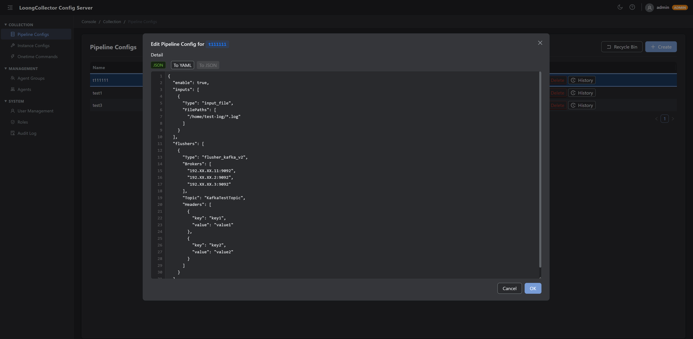

**Pipeline 配置回滚**

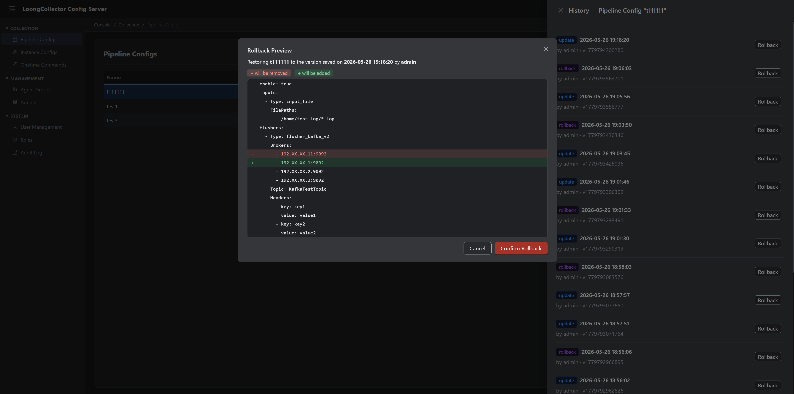

**Instance 配置列表**

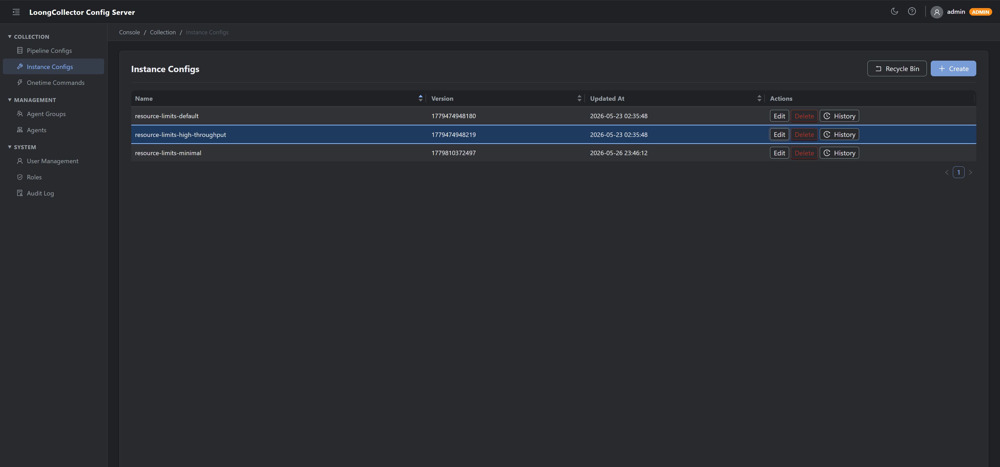

**Instance 配置详情**

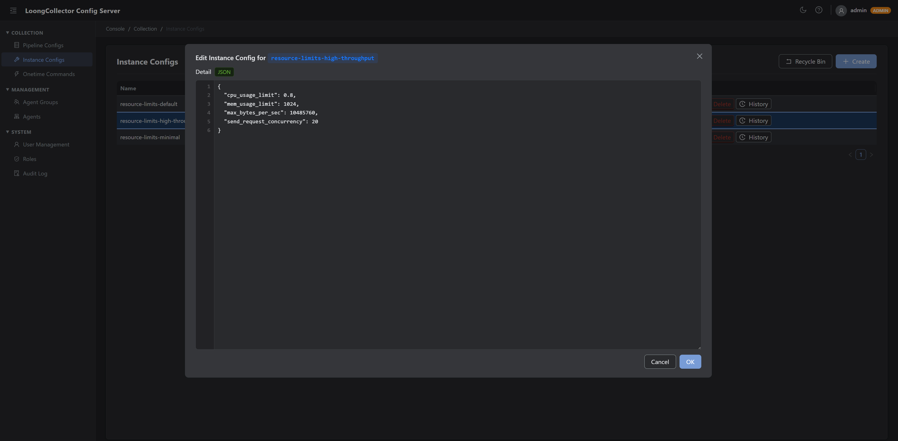

**Instance 配置回滚**

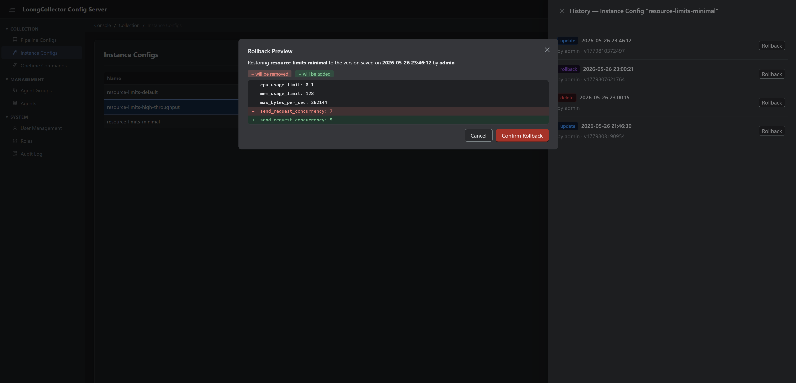

**一次性命令（Onetime Commands）**

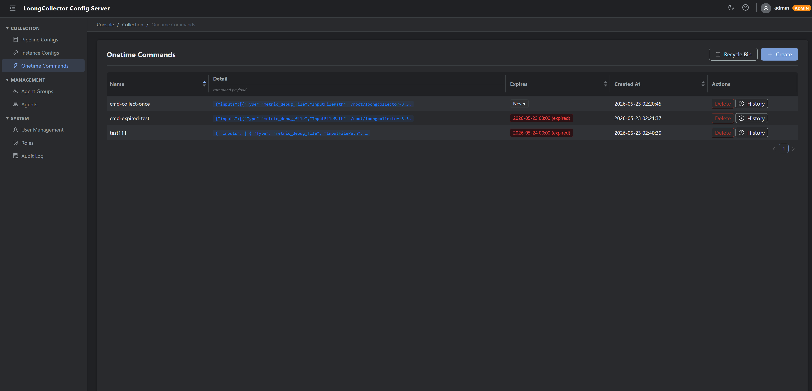

### Agent 管理

**Agent 信息**

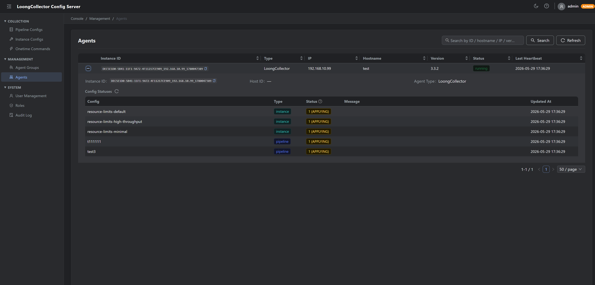

**Agent 分组列表**

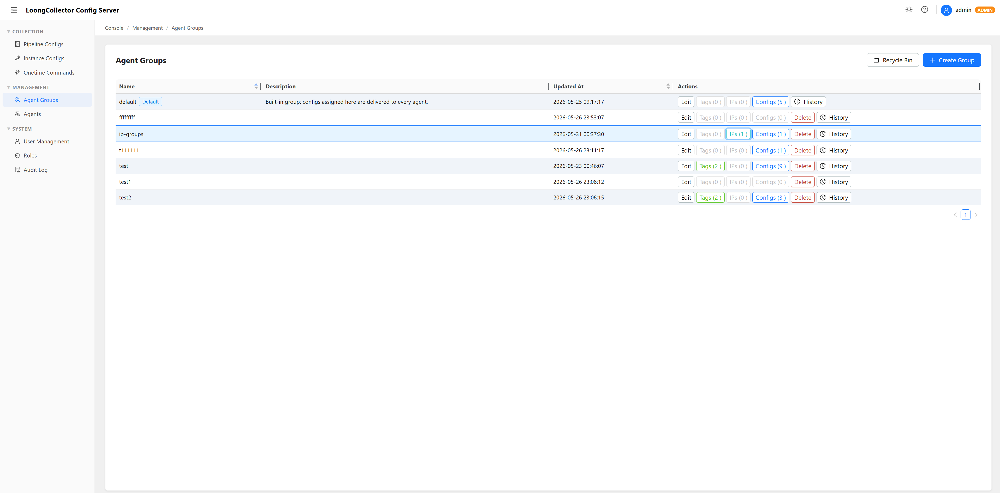

**Agent 分组详情**

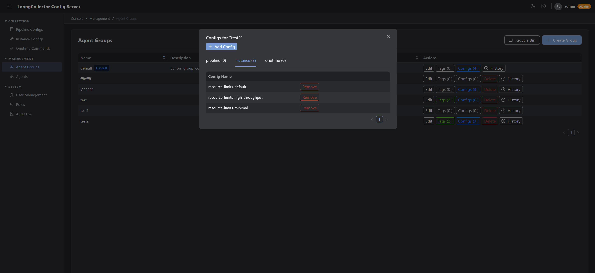

**Agent 分组 IP 选择器**

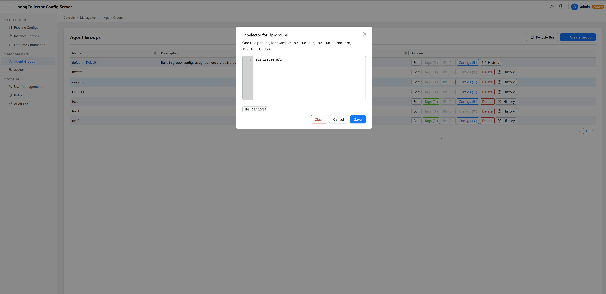

**Agent 分组回滚**

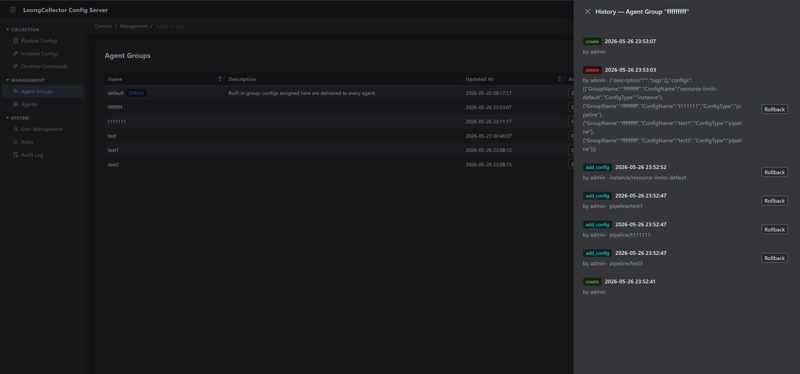

### 系统管理

**用户管理**

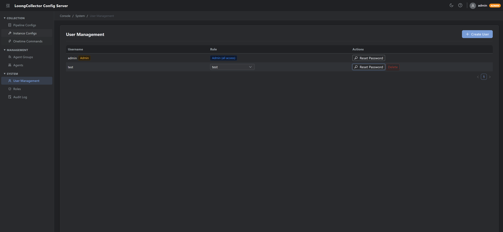

**角色管理**

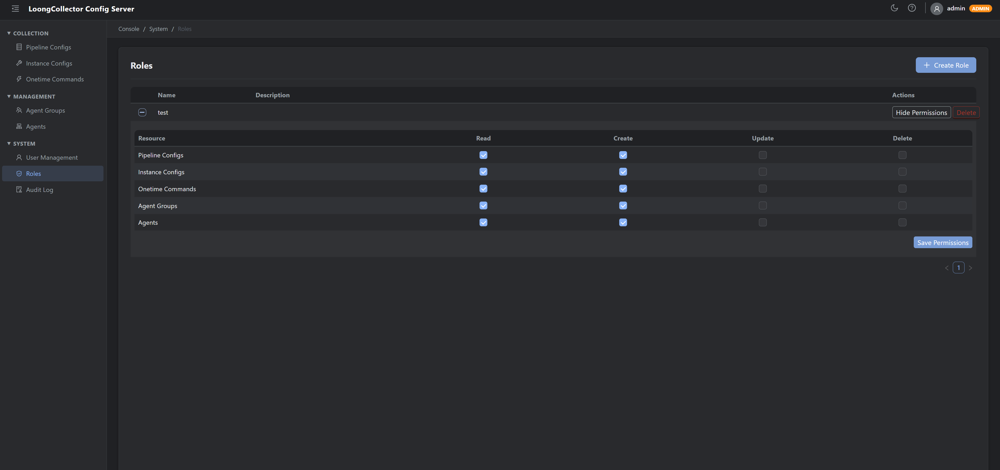

**审计日志**

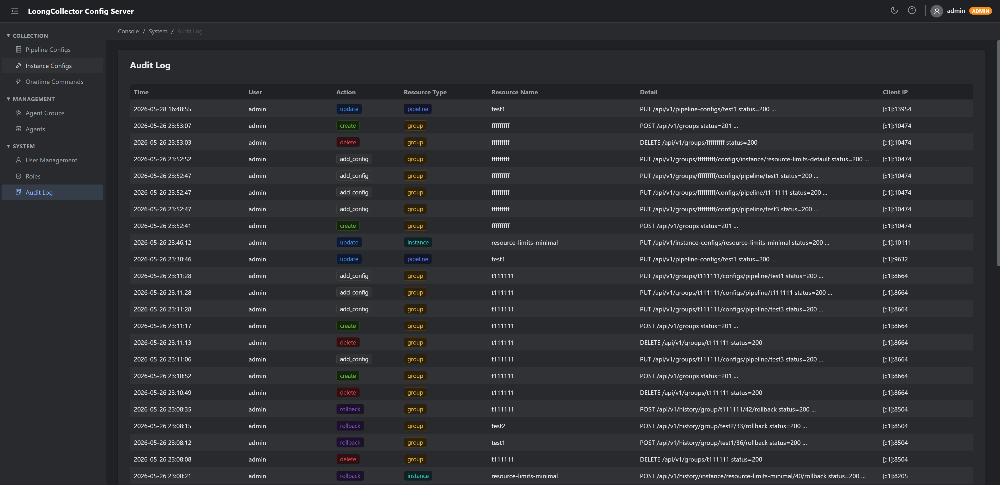

---

## 目录

- [架构概览](#架构概览)
- [部署模式](#部署模式)
- [快速开始（All-in-One）](#快速开始all-in-one)
- [分布式部署](#分布式部署)
- [配置参考](#配置参考)
- [配置更新通知机制](#配置更新通知机制)
- [配置历史与回滚](#配置历史与回滚)
- [一次性命令（Onetime Commands）](#一次性命令onetime-commands)
- [基于 IP 组的配置下发](#基于-ip-组的配置下发)
- [REST API 参考](#rest-api-参考)
- [故障排查](#故障排查)

---

## 架构概览

```
┌─────────────────────────────────────────────────────────┐
│                    LoongCollector Agent                  │
│            heartbeat + fetch config (HTTP)              │
└──────────────────────┬──────────────────────────────────┘
                       │ :8080
          ┌────────────▼────────────┐
          │      configserver       │  Agent API
          │  (可水平扩展多副本)      │
          └────────┬────────────────┘
                   │ MySQL + Redis
          ┌────────▼────────────────┐
          │         admin           │  管理 REST API + WebUI
          │                         │  :8081
          └─────────────────────────┘
                   │
          ┌────────▼────────────────┐
          │   MySQL (配置持久化)     │
          │   Redis  (缓存 + 失效)  │
          └─────────────────────────┘
```

**All-in-One** 模式：configserver + admin 合并为单进程，无需 Redis，使用 SQLite 即可运行。

---

## 部署模式

| 模式 | 二进制 | 数据库 | Redis | 适用场景 |
|------|--------|--------|-------|---------|
| **All-in-One** | `allinone` | SQLite / MySQL | 可选 | 开发、小规模生产 |
| **Admin** | `admin` | MySQL（必须）| 必须 | 分布式管理节点 |
| **ConfigServer** | `configserver` | MySQL（必须）| 必须 | 分布式 Agent 接入节点（可多副本） |

---

## 快速开始（All-in-One）

### 1. 编译

```bash
# Linux / macOS
bash build.sh allinone

# Windows (PowerShell)
.\build.ps1 allinone
```

### 2. 直接运行（使用内置默认值）

```bash
./bin/allinone
# Agent API: http://0.0.0.0:8080
# Admin WebUI: http://0.0.0.0:8081
# 数据库: ./configserver.db (SQLite)
```

### 3. 使用 YAML 配置文件

复制示例文件并按需修改：

```bash
cp config.allinone.example.yaml config.yaml
./bin/allinone -config config.yaml
```

### 4. 首次登录

浏览器访问 `http://localhost:8081`，系统会引导设置 admin 初始密码，设置完成后跳转登录页面。

### 5. MySQL 替代 SQLite（可选）

编辑 `config.yaml`：

```yaml
database:
  driver: mysql
  dsn: "user:password@tcp(127.0.0.1:3306)/configserver?charset=utf8mb4&parseTime=True&loc=Local"
```

---

## 分布式部署

分布式模式下 **admin** 和 **configserver** 分进程运行，必须共享 MySQL 和 Redis。

### 1. 编译所有二进制

```bash
bash build.sh        # Linux / macOS
.\build.ps1          # Windows
```

### 2. 启动 Admin 节点

```bash
cp config.admin.example.yaml config.admin.yaml
# 编辑 config.admin.yaml 填写 MySQL DSN 和 Redis 地址
./bin/admin -config config.admin.yaml
```

### 3. 启动 ConfigServer 节点（可多副本）

```bash
cp config.configserver.example.yaml config.configserver.yaml
# 编辑 config.configserver.yaml 填写相同的 MySQL DSN 和 Redis 地址
./bin/configserver -config config.configserver.yaml

# 水平扩展：启动更多副本，放在负载均衡后面
./bin/configserver -config config.configserver.yaml  # 副本 2
```

---

## 配置参考

所有选项均支持三种方式设置，优先级从高到低：

```
环境变量  >  YAML 文件  >  内置默认值
```

### YAML 完整字段说明

```yaml
database:
  driver: sqlite          # sqlite | mysql
  dsn: configserver.db    # SQLite 文件路径，或 MySQL DSN

redis:
  addr: ""                # Redis 地址，如 "127.0.0.1:6379"；空字符串表示禁用
  password: ""            # Redis AUTH 密码
  db: 0                   # Redis 逻辑库编号（0-15）

cache:
  l1_max_size_mb: 100     # 进程内 L1 缓存最大容量（MiB）
  l1_ttl: 5m              # L1 缓存 TTL（Go duration 格式：5m / 1h / 30s）
  l2_ttl: 720h            # L2 Redis 缓存 TTL（默认 30 天）

agent_server:
  host: "0.0.0.0"         # Agent API 监听地址
  port: 8080

admin_server:
  host: "0.0.0.0"         # Admin WebUI / REST API 监听地址
  port: 8081

metrics:
  push_url: ""            # Prometheus 远程写入地址（空 = 禁用推送）
                          # 示例: "http://vmagent:8429/api/v1/import/prometheus"
  push_interval: 30s      # 推送间隔
  online_window: 5m       # 心跳超过此时间未更新的 Agent 计为离线
```

### 等效环境变量

| YAML 字段 | 环境变量 | 默认值 |
|-----------|----------|--------|
| `database.driver` | `CONFIGSERVER_DB_DRIVER` | `sqlite` |
| `database.dsn` | `CONFIGSERVER_DB_DSN` | `configserver.db` |
| `redis.addr` | `CONFIGSERVER_REDIS_ADDR` | `""` |
| `redis.password` | `CONFIGSERVER_REDIS_PASSWORD` | `""` |
| `redis.db` | `CONFIGSERVER_REDIS_DB` | `0` |
| `cache.l1_max_size_mb` | `CONFIGSERVER_L1_MAX_SIZE_MB` | `100` |
| `cache.l1_ttl` | `CONFIGSERVER_L1_TTL` | `5m` |
| `cache.l2_ttl` | `CONFIGSERVER_L2_TTL` | `720h` |
| `agent_server.host` | `CONFIGSERVER_AGENT_HOST` | `0.0.0.0` |
| `agent_server.port` | `CONFIGSERVER_AGENT_PORT` | `8080` |
| `admin_server.host` | `CONFIGSERVER_ADMIN_HOST` | `0.0.0.0` |
| `admin_server.port` | `CONFIGSERVER_ADMIN_PORT` | `8081` |
| `metrics.push_url` | `CONFIGSERVER_METRICS_PUSH_URL` | `""` |
| `metrics.push_interval` | `CONFIGSERVER_METRICS_PUSH_INTERVAL` | `30s` |
| `metrics.online_window` | `CONFIGSERVER_METRICS_ONLINE_WINDOW` | `5m` |

环境变量可以在运行时覆盖 YAML 中的对应值，例如：

```bash
CONFIGSERVER_ADMIN_PORT=9090 ./bin/allinone -config config.yaml
```

---

## 配置更新通知机制

> 本节说明分布式模式下 **admin 如何将配置变更实时通知到 configserver**。

### 通知链路

```
管理员在 WebUI 保存配置
        │
        ▼
admin 进程 — Manager.UpdatePipelineConfig()
        ├─ ① 写入 MySQL（持久化，真相来源）
        └─ ② InvalidatePipelineConfig("cfg:pipeline:<name>")
                  ├─ 删除本进程 L1 缓存（freecache）
                  ├─ 删除 Redis L2 缓存（DEL key）
                  └─ Publish → Redis Pub/Sub 频道 "configserver:invalidate"
                                      │           payload = "cfg:pipeline:<name>"
                                      │ 毫秒级传播
                                      ▼
                          configserver 实例（每个副本）
                          subscribeInvalidations() goroutine
                                      │
                                      └─ 删除本进程 L1 中的该 key
                                                │
                                                ▼  （Agent 下次心跳）
                                      L1 miss → L2 miss → 读 MySQL → 返回新配置
                                      回填 L1 + L2
```

### 各阶段延迟

| 阶段 | 延迟 |
|------|------|
| MySQL 写入 | < 10ms |
| Redis Pub/Sub 传播（同机房）| < 5ms |
| configserver L1 失效 | Pub/Sub 消息到达即完成 |
| Agent 感知到新配置 | 下一次心跳间隔（Agent 侧配置，通常 10–30s）|

### All-in-One 模式

admin 与 configserver 在同一进程内共享同一个 `Manager` 实例，写操作直接失效 L1，无需 Redis 和 Pub/Sub。

### 设计要点

- **写穿透（Write-Through）**：所有写操作先落 MySQL，再失效缓存，保证不会脏读。
- **主动失效（Invalidation）而非推送**：configserver 收到失效消息后，仅清除 L1；Agent 下次心跳拉取时才从 MySQL 重新加载，避免无效推送。
- **singleflight 防击穿**：同一 key 并发缓存 miss 时，只有一个 goroutine 实际查询 MySQL。
- **水平扩展**：多个 configserver 副本均订阅同一 Redis 频道，失效消息广播给所有副本，天然支持横向扩展。

---

## 配置历史与回滚

> 每一次对 pipeline 配置、instance 配置、分组或 onetime command 的写操作（创建、更新、删除、回滚）都会自动快照到 `config_history` 表，永久保留。

### 版本号说明

每条配置记录的 `version` 字段为**毫秒级 Unix 时间戳**，由写操作时 `time.Now().UnixMilli()` 生成，保证单调递增且全局唯一。

### 查看历史记录

```http
GET /api/v1/history/{type}/{name}
```

`{type}` 取值：`pipeline` | `instance` | `group` | `onetime`

**示例**：

```bash
# 查看 my-pipeline 的完整变更历史
curl http://localhost:8081/api/v1/history/pipeline/my-pipeline

# 响应（按时间倒序，最新在前）
[
  {
    "id": 42,
    "resource_type": "pipeline",
    "resource_name": "my-pipeline",
    "version": 1748563200000,
    "action": "update",
    "detail": "<当前 YAML 内容>",
    "changed_by": "admin",
    "changed_at": "2026-05-29T12:00:00Z"
  },
  {
    "id": 41,
    "resource_type": "pipeline",
    "resource_name": "my-pipeline",
    "version": 1748476800000,
    "action": "create",
    "detail": "<初始 YAML 内容>",
    "changed_by": "admin",
    "changed_at": "2026-05-28T12:00:00Z"
  }
]
```

### 回滚到指定历史版本

```http
POST /api/v1/history/{type}/{name}/{id}/rollback
```

- `{id}` 为历史记录的主键，从上述历史查询接口获取
- 回滚时，指定记录的 `detail`（内容快照）将被写入当前配置，并触发缓存失效
- 回滚操作本身作为 `action: rollback` 记录到历史表，可再次回滚
- 若目标记录是 `action: delete`（`detail` 为空），则返回 `400 Bad Request`，不允许回滚到已删除状态

**示例**：

```bash
# 将 my-pipeline 回滚到 id=41 的历史版本
curl -X POST http://localhost:8081/api/v1/history/pipeline/my-pipeline/41/rollback
```

回滚完成后，所有已连接的 Agent 将在下一次心跳时拉取到回滚后的配置。

### 恢复已删除的配置（回收站）

```http
GET /api/v1/deleted-history/{type}
```

返回该类型下每个被删除的资源名的**最近一次 delete 记录**（即回收站视图）。

**典型恢复流程**：

```bash
# 1. 列出所有已删除的 pipeline 配置
curl http://localhost:8081/api/v1/deleted-history/pipeline

# 2. 找到要恢复的记录，取其 id（例如 id=38）
# 3. 通过回滚接口恢复（此时 action=delete，detail 中保存了删除前的快照）
curl -X POST http://localhost:8081/api/v1/history/pipeline/my-pipeline/38/rollback
```

> **注意**：恢复已删除配置时，系统会重新 `Create` 该配置（而非 `Update`），因为当前数据库中已无对应记录。

### 审计日志

```http
GET /api/v1/audit-logs
```

每次写操作（包括回滚）均写入审计日志，记录操作人、客户端 IP、操作时间和详情，便于合规追溯。

---

## 一次性命令（Onetime Commands）

> Onetime Command 是一种**瞬态配置下发机制**，用于向 Agent 下发**只需执行一次**的 pipeline 配置（例如临时调试采集、一次性数据迁移）。

### 与普通配置的区别

| 维度 | Pipeline Config | Onetime Command |
|------|----------------|-----------------|
| 持久性 | 持久化，Agent 每次心跳都拉取 | 仅下发一次，Agent 确认后不再重复下发 |
| 存储位置 | Agent 落盘（配置目录） | Agent 写入临时目录，不影响正式配置 |
| 过期机制 | 无 | `expire_time`（Unix 毫秒），过期后 Agent 拒绝执行 |
| 灰度/金丝雀 | 需借助分组标签 | 直接指定命令名，按组或 Agent 实例过滤 |
| 回滚 | 通过历史版本 | 删除后可通过历史版本重新下发 |

### 创建一次性命令

```bash
curl -X POST http://localhost:8081/api/v1/onetime-commands \
  -H "Content-Type: application/json" \
  -d '{
    "name": "debug-nginx-20260529",
    "detail": "enable_processors: true\ninputs:\n  - Type: input_file\n    FilePaths: [\"/var/log/nginx/*.log\"]",
    "expire_time": 1748649600000
  }'
```

字段说明：

| 字段 | 类型 | 说明 |
|------|------|------|
| `name` | string | 命令唯一名称，同名命令不可重复创建 |
| `detail` | string | pipeline 配置内容（YAML） |
| `expire_time` | int64 | 过期时间（Unix 毫秒），Agent 在 `expire_time` 之后收到此命令会拒绝执行；`0` 表示永不过期 |

### 查看与取消命令

```bash
# 列出所有待下发的一次性命令
curl http://localhost:8081/api/v1/onetime-commands

# 查看单条命令
curl http://localhost:8081/api/v1/onetime-commands/debug-nginx-20260529

# 取消（删除）命令 —— Agent 尚未消费时有效
curl -X DELETE http://localhost:8081/api/v1/onetime-commands/debug-nginx-20260529
```

### 下发流程

```
管理员 POST /api/v1/onetime-commands
         │
         ▼
   写入 MySQL onetime_commands 表
         │
         │  Agent 心跳（携带当前已知命令列表）
         ▼
   configserver 返回新增命令列表
         │
         ▼
   Agent 写入临时配置目录，加载 pipeline
         │  加载成功 / 失败后
         ▼
   Agent 下次心跳上报执行状态（feedback）
         │  命令已消费
         ▼
   configserver 标记命令为已下发，不再返回给该 Agent
```

### 重新下发命令（回滚）

若命令已被删除但需要重新向某 Agent 下发，可借助历史回滚接口：

```bash
# 查看历史（找到被删除命令的 id）
curl http://localhost:8081/api/v1/deleted-history/onetime

# 回滚（重新创建同名命令，Agent 将重新收到）
curl -X POST http://localhost:8081/api/v1/history/onetime/debug-nginx-20260529/{id}/rollback
```

---

## 基于 IP 组的配置下发

除了**标签（Tag）匹配**之外，分组还支持通过 **IP 选择器**将配置下发到指定 IP 的 Agent。

### 匹配语义

Agent 满足以下任意条件即可从分组获取配置：

| 条件 | 说明 |
|------|------|
| 默认分组（`default`） | 所有 Agent 始终获取默认分组的配置 |
| 标签匹配 | Agent 心跳携带的标签与分组标签完全匹配 |
| **IP 匹配** | Agent 的 IP 地址在分组的 IP 选择器范围内 |

### IP 选择器规则格式

IP 选择器支持以下三种规则，每行一条：

| 格式 | 示例 | 说明 |
|------|------|------|
| 单个 IP | `192.168.1.5` | 精确匹配单个地址 |
| 短程范围 | `192.168.1.200-230` | 同一 /24 网段内最后一段连续范围 |
| 完整范围 | `10.0.0.1-10.0.0.254` | 任意起止 IP 范围（含两端） |
| CIDR | `192.168.1.0/24`，`10.10.0.0/16` | 标准 CIDR 子网 |

### 管理 IP 选择器

**通过 WebUI**：进入「Agent 管理 → 分组」，点击对应分组行的 **IPs** 按钮，在弹窗中编辑规则（每行一条），保存后立即生效。

**通过 REST API**：

```bash
# 查看当前 IP 选择器
curl http://localhost:8081/api/v1/groups/app_group1/ip-selector
# 响应: {"ips":["192.168.1.200-230","10.0.0.0/24"]}

# 设置 IP 选择器
curl -X PUT http://localhost:8081/api/v1/groups/app_group1/ip-selector \
  -H 'Content-Type: application/json' \
  -d '{"ips":["192.168.1.2","192.168.1.200-230","10.10.0.0/16"]}'

# 清空 IP 选择器（该分组不再按 IP 匹配）
curl -X DELETE http://localhost:8081/api/v1/groups/app_group1/ip-selector
```

### 示例：按 IP 段下发配置

```bash
# 1. 创建分组
curl -X POST http://localhost:8081/api/v1/groups \
  -H 'Content-Type: application/json' \
  -d '{"Name":"app_group1","Description":"应用服务器组"}'

# 2. 设置 IP 选择器（覆盖 192.168.1.2 和 192.168.1.200-230）
curl -X PUT http://localhost:8081/api/v1/groups/app_group1/ip-selector \
  -H 'Content-Type: application/json' \
  -d '{"ips":["192.168.1.2","192.168.1.200-230"]}'

# 3. 将 Pipeline 配置关联到该分组
curl -X PUT http://localhost:8081/api/v1/groups/app_group1/configs/pipeline/nginx-access-log

# 结果：IP 在上述范围内的 Agent 心跳时将自动获取 nginx-access-log 配置
```

---

## REST API 参考

Admin API 基础路径：`http://<admin-host>:8081`。所有写操作接口需携带有效 session cookie（先调用 `/api/v1/auth/login` 获取）。

### Pipeline 配置

| 方法 | 路径 | 说明 |
|------|------|------|
| GET | `/api/v1/pipeline-configs` | 列出所有 pipeline 配置 |
| POST | `/api/v1/pipeline-configs` | 创建 pipeline 配置 |
| GET | `/api/v1/pipeline-configs/{name}` | 获取指定配置 |
| PUT | `/api/v1/pipeline-configs/{name}` | 更新配置（触发缓存失效） |
| DELETE | `/api/v1/pipeline-configs/{name}` | 删除配置 |

### Instance 配置

| 方法 | 路径 | 说明 |
|------|------|------|
| GET | `/api/v1/instance-configs` | 列出所有 instance 配置 |
| POST | `/api/v1/instance-configs` | 创建 instance 配置 |
| GET | `/api/v1/instance-configs/{name}` | 获取指定配置 |
| PUT | `/api/v1/instance-configs/{name}` | 更新配置 |
| DELETE | `/api/v1/instance-configs/{name}` | 删除配置 |

### 分组管理

| 方法 | 路径 | 说明 |
|------|------|------|
| GET | `/api/v1/groups` | 列出所有分组 |
| POST | `/api/v1/groups` | 创建分组 |
| GET | `/api/v1/groups/{name}` | 获取分组详情 |
| PUT | `/api/v1/groups/{name}` | 更新分组 |
| DELETE | `/api/v1/groups/{name}` | 删除分组 |
| GET | `/api/v1/groups/{name}/tags` | 获取分组标签 |
| PUT | `/api/v1/groups/{name}/tags` | 设置分组标签 |
| GET | `/api/v1/groups/{name}/ip-selector` | 获取分组 IP 选择器 |
| PUT | `/api/v1/groups/{name}/ip-selector` | 设置分组 IP 选择器（单 IP / 范围 / CIDR）|
| DELETE | `/api/v1/groups/{name}/ip-selector` | 清空分组 IP 选择器 |
| GET | `/api/v1/groups/{name}/configs` | 查看分组下关联的配置 |
| PUT | `/api/v1/groups/{name}/configs/{type}/{configName}` | 添加配置到分组 |
| DELETE | `/api/v1/groups/{name}/configs/{type}/{configName}` | 从分组移除配置 |

### 一次性命令

| 方法 | 路径 | 说明 |
|------|------|------|
| GET | `/api/v1/onetime-commands` | 列出所有待下发命令 |
| POST | `/api/v1/onetime-commands` | 创建一次性命令 |
| GET | `/api/v1/onetime-commands/{name}` | 获取指定命令 |
| DELETE | `/api/v1/onetime-commands/{name}` | 取消/删除命令 |

### 历史记录与回滚

| 方法 | 路径 | 说明 |
|------|------|------|
| GET | `/api/v1/history/{type}/{name}` | 获取资源变更历史（`type`: pipeline \| instance \| group \| onetime） |
| GET | `/api/v1/deleted-history/{type}` | 获取已删除资源列表（回收站） |
| POST | `/api/v1/history/{type}/{name}/{id}/rollback` | 回滚到指定历史版本 |

### Agent 信息（只读）

| 方法 | 路径 | 说明 |
|------|------|------|
| GET | `/api/v1/agents` | 列出所有 Agent 及状态 |
| GET | `/api/v1/agents/{instanceID}` | 获取指定 Agent 详情 |

### 审计与认证

| 方法 | 路径 | 说明 |
|------|------|------|
| GET | `/api/v1/audit-logs` | 查看操作审计日志 |
| GET | `/api/v1/auth/status` | 检查初始化状态 |
| POST | `/api/v1/auth/init` | 初始化 admin 密码（首次使用） |
| POST | `/api/v1/auth/login` | 登录，返回 session cookie |
| POST | `/api/v1/auth/logout` | 登出 |
| POST | `/api/v1/auth/change-password` | 修改当前用户密码 |

---

## 故障排查

### 配置更新后 Agent 未生效

1. 确认 Agent 心跳正常：`GET /api/v1/agents/{instanceID}` 查看 `last_heartbeat_at`
2. 检查 configserver 日志，确认缓存失效消息是否到达
3. 分布式模式下：验证 Redis Pub/Sub 连通性，`redis-cli SUBSCRIBE configserver:invalidate`
4. 缓存 TTL：即使 Pub/Sub 中断，L1 TTL（默认 5 分钟）到期后 Agent 可自动拿到新配置

### 回滚后配置未下发到 Agent

- 回滚会触发与普通 `UPDATE` 相同的缓存失效流程，Agent 下次心跳（通常 10–30s）即可感知
- 若心跳后仍未更新，检查 Agent 侧 `configserver_address` 指向是否正确
- All-in-One 模式下回滚不依赖 Redis，问题通常在于 Agent 心跳间隔较长

### Onetime Command 未被 Agent 执行

| 可能原因 | 排查方法 |
|----------|----------|
| 命令已过期 | `GET /api/v1/onetime-commands/{name}` 检查 `expire_time` 是否早于当前时间 |
| 命令已被消费 | 命令已从列表消失，表示 Agent 已消费；查审计日志确认 |
| Agent 未与 configserver 通信 | 检查 Agent 日志或 `GET /api/v1/agents` 的 `last_heartbeat_at` |
| 命令 `detail` 格式错误 | Agent 会上报 feedback，查 configserver 日志中的 feedback 错误信息 |
| 同名命令曾被该 Agent 消费 | Onetime 按名称去重；需换新名称重新下发 |

### All-in-One 启动失败（exit code 1）

- 默认使用当前目录下的 `configserver.db`，确保运行目录有写权限
- 使用 `-config config.yaml` 显式指定配置文件路径可避免路径歧义
- Windows 下建议在 PowerShell 中以管理员权限运行，或将可执行文件和配置文件放置在有写权限的目录
